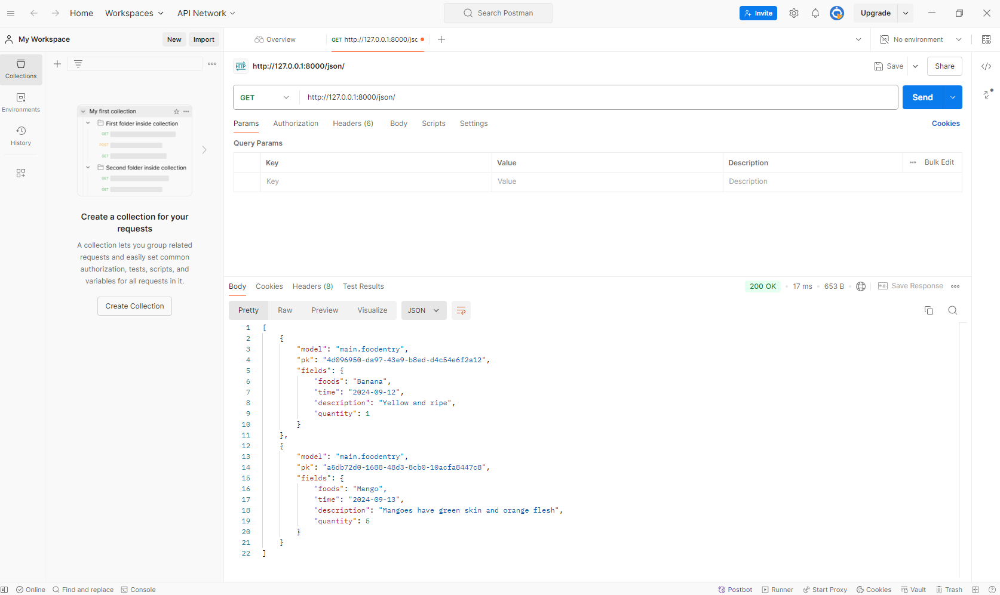

Link to the PWS application : http://damar-aryaputra-damshop.pbp.cs.ui.ac.id/

# ASSIGNMENT 2

**Explain how you implemented the checklist above step-by-step :**

- Create a new directory with the name dam-shop
- Enable virtual environment and install requirements.txt 
- Create the django project by running django-admin startproject dam_shop
- Then run python manage.py startapp main so that we can create a new application with the name main
- To  perform routing in main, you just need to add 'main' in the settings.py file inside the dam_shop directory
- Make a folder and inside it make a html file that have attributes name,price,description
- Make the def function and create the variables that you want to input to the html
- Import the name of the def function that you create and make a path to the def function in the urls.py in main directory
- Connect your application with the pws by creating the project damshop in pws and go git add,branch and push to pws

**Create a diagram that contains the request client to a Django-based web application and the response it gives, and explain the relationship between urls.py, views.py, models.py, and the html file.**


**Explain the use of git in software development!**

Git is a version control system that helps developers manage changes to code, collaborate efficiently, and maintain a complete history of a project. It allows multiple developers to work on different branches simultaneously, making it easier to implement new features or fix bugs without affecting the main codebase. Git tracks changes, supports rollback to previous versions, and facilitates merging code through pull requests and code reviews. Additionally, it integrates with continuous integration pipelines for automated testing, ensuring higher code quality and smooth deployment.


**In your opinion, out of all the frameworks available, why is Django used as the starting point for learning software development?**

Django is often chosen as a starting point for learning software development because it is a high-level, full-stack web framework that simplifies many complex aspects of web development. It follows the Model-View-Template (MVT) architectural pattern, helping learners understand the core structure of web applications. Django emphasizes best practices like DRY (Don’t Repeat Yourself) and rapid development, allowing beginners to focus on learning the fundamentals without getting bogged down by low-level details. Its comprehensive documentation, built-in features like authentication, and a strong community make it accessible and practical for building real-world applications early on.


**Why is the Django model called an ORM?**

The Django model is called an ORM (Object-Relational Mapping) because it allows developers to interact with a relational database using Python objects, rather than writing raw SQL queries. In an ORM, database tables are represented as Python classes (models), and rows in these tables are instances of those classes. Django’s ORM automatically generates the necessary SQL to create, retrieve, update, and delete records based on the model’s structure. This abstraction simplifies database interactions, allowing developers to work in Python while the ORM handles the translation between Python objects and database records.


# Assignment 3

**Explain why we need data delivery in implementing a platform.**

Data delivery is essential in platform implementation because it ensures efficient, secure, and timely transmission of information. It enables real-time interactions, synchronizes components, maintains data consistency, and supports scalability. Additionally, secure data delivery protects sensitive information, facilitates integration with external services, and enhances the overall user experience. Without reliable data delivery, platforms would face performance, reliability, and security issues.

**In your opinion, which is better, XML or JSON?**

In my opinion it depends, when I'm are dealing with documents, metadata, complex hierarchies, or if you need namespaces and strict validation I,m gonna use XML. But sometimes use JSON over XML when efficiency, ease of use, and lightweight data transmission are required, especially in web and mobile applications. But generally JSON is better than XML for most modern use cases, especially for web applications and APIs.

**Why is JSON more popular than XML?**

JSON is more popular because it’s simpler, faster, and better suited to the needs of modern applications, particularly in the web development space. XML, while powerful, is often overkill for most use cases where JSON shines.

**Explain the functional usage of is_valid() method in Django forms. Also explain why we need the method in forms.**

In Django, the is_valid() method is used to validate data submitted through a form. It checks whether the data provided in the form fields meets all the defined validation rules.

We need is_valid() in Django forms since its essential for validating submitted data, ensuring it adheres to the required format and rules, and providing user feedback for errors. Without it, handling form data safely and efficiently would be far more difficult.

**Why do we need csrf_token when creating a form in Django?**

To prevent CSRF attack where a malicious website tricks a user's browser into making unwanted requests to another site where the user is authenticated.

**What could happen if we did not use csrf_token on a Django form?**

If someone do a successful CSRF attack, the attacker causes the victim user to carry out an action unintentionally.

**How could this be leveraged by an attacker?**

For example, this might be to change the email address on their account, to change their password, or to make a funds transfer depending on the nature of the action.

**Explain how you implemented the checklist above step-by-step (not just following the tutorial).**

- Create the entry food models by adding this code to models.py
```py
    def create_food_entry(request):
        form = FoodEntryForm(request.POST or None)
        if form.is_valid() and request.method == "POST":
            form.save()
            return redirect("main:show_main")
```
- After that you make the appearance by creating this code in views.py
```py
    def create_food_entry(request):
        form = FoodEntryForm(request.POST or None)
        if form.is_valid() and request.method == "POST":
            form.save()
            return redirect("main:show_main")
    
        context ={'form': form}
        return render(request, "create_food_entry.html", context)
```
- To make the model appear in the web, we need to add the html file with the code like this

```html
    <table>
  <tr>
    <th>Food Name</th>
    <th>Time</th>
    <th>Description</th>
    <th>Quantity</th>
  </tr>

  
  <tr>
    <td>{{food_entry.foods}}</td>
    <td>{{food_entry.time}}</td>
    <td>{{food_entry.description}}</td>
    <td>{{food_entry.quantity}}</td>
  </tr>
  
</table>
```

- Create def for the XML,JSON, XML_ID and JSON ID by adding the code in views, we need HttpResponse so that we can view the xml/json data/id just by adding /xml/ or /json/ etc in the url. 

**Access the four URLs in point 2 using Postman, take screenshots of the results in Postman, and add them to README.md**

XML Photo


XML_ID Photo


JSON Photo


JSON_ID Photo


# Assignment 4

**What is the difference between HttpResponseRedirect() and redirect()**

HttpResponseRedirect() is a class-based response that returns an HTTP response with a status code 302 (which indicates a redirect). Meanwhile redirect() is a convenience function provided by Django to simplify the redirection process. In most cases, developers prefer to use redirect() for its simplicity and automatic URL resolution, but HttpResponseRedirect() can be useful if you want to control the URL handling more directly.

**Explain how the MoodEntry model is linked with User!**

In the given Django model, the FoodEntry model is linked to the User model using a ForeignKey relationship. Here's how this works:

```py
user = models.ForeignKey(User, on_delete=models.CASCADE)
```

This line defines a relationship between the FoodEntry model and Django's built-in User model from django.contrib.auth.models.In summary, the user field links each FoodEntry to a specific user, creating a clear relationship between the models and making it easy to track which user created each food entry.

**What is the difference between authentication and authorization, and what happens when a user logs in? Explain how Django implements these two concepts.**

Authentication is the process of verifying a user's identity. It answers the question: Who are you? Meanwhile Authorization occurs after authentication and determines what actions or resources a user is allowed to access. It answers the question: What are you allowed to do?

What Happens When a User Logs In ?
When a user logs into a Django application, the following steps typically occur:

1. User provides credentials: The user submits their username and password through a login form.

2. Authentication Process:

- Django checks the submitted credentials against the stored user data (usually in the User model).
- If the credentials match (and the user is active), Django considers the user "authenticated".
- Django creates a session for the user, stores session data (including the user's ID), and sends the session ID back to the user's browser as a cookie.

3. User Session: Once the user is logged in and authenticated, Django assigns them a session. The session is stored server-side, while the session key is stored as a cookie on the client's browser. This allows the user to remain logged in across different views and requests.

4. Authorization: After authentication, every time the user attempts to perform an action (such as accessing a view or editing data), Django checks whether the user has the necessary permissions (authorization) to perform that action.

- Django often checks authorization using permission-based checks (like is_staff or is_superuser) or group-based permissions, which control access to certain views, models, or objects.

Explain how Django implements these two concepts.
When a user logs in, Django authenticates them, creates a session for them, and then applies authorization checks whenever they attempt to perform specific actions or access restricted resources.

**How does Django remember logged-in users? Explain other uses of cookies and whether all cookies are safe to use.**

- Django Remembers Logged-In Users: Django uses sessions stored server-side and a session cookie (sessionid) stored in the browser to keep users logged in across multiple requests.

- Other Uses of Cookies: Cookies are widely used for tracking user preferences, storing authentication tokens, enabling "remember me" functionality, tracking user activity (analytics), and protecting against CSRF attacks.

- Cookie Safety: Not all cookies are safe to use, especially if they are improperly configured. Storing sensitive data in cookies is a bad practice, and using Secure, HttpOnly, and SameSite flags enhances cookie security. Additionally, restricting the lifetime of cookies and using them only when necessary is important for minimizing security risks.

**Explain how did you implement the checklist step-by-step**

1. Implement Registration, Login, and Logout Functions
- Registration: Create a form to allow users to sign up. You can use Django’s built-in UserCreationForm or create a custom form. Add necessary fields such as username, password, and email. Once the form is validated, save the user details in the database.
- Login: Use Django’s built-in authenticate() and login() functions to verify user credentials.

```py
def login_user(request):
   if request.method == 'POST':
      form = AuthenticationForm(data=request.POST)

      if form.is_valid():
        user = form.get_user()
        login(request, user)
        response = HttpResponseRedirect(reverse("main:show_main"))
        response.set_cookie('last_login', str(datetime.datetime.now()))
        return response

   else:
      form = AuthenticationForm(request)
   context = {'form': form}
   return render(request, 'login.html', context)
```
- Logout: Use Django’s built-in logout() function.

```py
def logout_user(request):
    logout(request)
    response = HttpResponseRedirect(reverse('main:login'))
    response.delete_cookie('last_login')
    return response
```
2. Create Two User Accounts with Three Dummy Data
- Create two user accounts directly from the admin panel or programmatically.
- Create dummy data related to each user using the model connected to the user account. You can either seed this data in your models.py or via Django shell.
Photo Dummy 1


Photo Dummy 2


3. Connect Product and User Models
- You need to set up a foreign key relationship between Product and User models so each product is linked to a specific user.
```py
@login_required(login_url='/login')
def show_main(request):
    food_entries = FoodEntry.objects.filter(user=request.user)

    context = {
        'appname' : 'main',
        'name': request.user.username,
        'class': 'KKI',
        'food_entries': food_entries,
        'last_login': request.COOKIES['last_login'],
    }

    return render(request, "main.html", context)
```

4. Display Logged-in User Details and Last Login with Cookies
- After logging in, you can pass the logged-in user’s details to your main page.
```py
'last_login': request.COOKIES['last_login']
  
```

# Assignment 5

**If there are multiple CSS selectors for an HTML element, explain the priority order of these CSS selectors!**

When multiple CSS selectors apply to the same HTML element, CSS uses a specificity rule to determine which style takes precedence. The specificity hierarchy is as follows (from lowest to highest):

1. Type selectors (e.g., div, p, a) have the lowest specificity.
2. Class selectors (e.g., .container, .button) have higher specificity.
3. ID selectors (e.g., #header, #footer) have higher specificity than class selectors.
4. Inline styles (e.g., style="color: blue;" added directly in an HTML element) override all external or internal styles.
5. !important rule: Any declaration marked with !important takes the highest precedence and overrides any other styles, regardless of specificity.

Example:

```html
<p id="text" class="content">Hello World</p>
```

```css
p {
  color: blue;
} /* Type selector */
.content {
  color: green;
} /* Class selector */
#text {
  color: red;
} /* ID selector */
```
In this case, the paragraph will appear red because the ID selector has the highest specificity.

**Why does responsive design become an important concept in web application development? Give examples of applications that have and have not implemented responsive design!**

Responsive design ensures that a website or application adapts to different screen sizes and devices, such as mobile phones, tablets, and desktops. As users increasingly access the web on various devices, responsive design becomes essential for a good user experience.

Why it’s important:
- Improved user experience: A responsive design ensures that content is readable and easy to navigate regardless of the screen size.
- SEO benefits: Google prioritizes mobile-friendly websites in search rankings.
- Cost-effective: A responsive website means you don't need to maintain separate sites for mobile and desktop versions.

Example of Applications:
- Responsive design implemented: Websites like Twitter, YouTube, and Amazon automatically adjust their layouts based on the user’s device.
- Responsive design not implemented: Older websites or applications, such as Craigslist, may not adjust well to smaller screens, resulting in a poor user experience on mobile devices.

**Explain the differences between margin, border, and padding, and how to implement these three things!**

- Margin: The space outside the border of an element. It separates the element from other elements. Margins are transparent and don’t affect the content inside the element.

Example:
```css
div {
  margin: 10px; /* 10px space outside the border */
}
```


- Border: The area between the margin and padding, essentially the outline of an element. The border can have different styles (solid, dashed, etc.) and thicknesses.

Example:
```css
div {
  border: 2px solid black; /* Black solid border of 2px thickness */
}
```


- Padding: The space inside the border, between the content and the border. Padding pushes the content away from the edges of the element.

Example:
```css
div {
  padding: 15px; /* 15px space inside the element, between content and border */
}
```

In summary:

- Margin is the space outside the element’s border.
- Padding is the space inside the element’s border.
- Border surrounds the padding and content, visually framing the element.

**Explain the concepts of flex box and grid layout along with their uses!**
Flexbox:
The flexbox layout is used for arranging items in a one-dimensional space—either in a row (horizontal) or a column (vertical). It is excellent for creating flexible and responsive layouts without requiring fixed dimensions.

Key properties:
- flex-direction: Specifies the direction of the flex container’s children (row, column, etc.).
- justify-content: Aligns items horizontally (e.g., center, space-between, space-around).
- align-items: Aligns items vertically (e.g., flex-start, flex-end, center).
Example:
```css
.container {
  display: flex;
  flex-direction: row;
  justify-content: center;
  align-items: center;
}
```
Use case: Flexbox is great for layouts like navigation bars, centering content, and aligning items within a container in one direction.

Grid:
The grid layout is a two-dimensional system that allows you to design both rows and columns. It’s more powerful than flexbox when you need to manage complex layouts that span both axes.

Key properties:
-grid-template-columns: Defines the number and size of columns.
-grid-template-rows: Defines the number and size of rows.
-grid-gap: Specifies the space between grid items.
```css
.container {
  display: grid;
  grid-template-columns: 1fr 1fr 1fr; /* 3 equal columns */
  grid-template-rows: auto;
  grid-gap: 10px; /* Space between grid items */
}
```
Use case: Grid is ideal for creating complex layouts such as dashboards, gallery views, and multi-sectioned pages.

In summary:

Flexbox is for one-dimensional layouts (either row or column).
Grid is for two-dimensional layouts (rows and columns together).


**Step-by-Step Guide to Implement the Checklist**

1. Implement Functions to Delete and Edit Products
Create a view that handles editing a product and fetch the product by its id then pass it to the form for editing.
```py
def edit_food(request, id):
    food = FoodEntry.objects.get(pk=id)
    form = FoodEntryForm(request.POST or None, instance=food)

    if form.is_valid() and request.method == "POST":
        form.save()
        return HttpResponseRedirect(reverse('main:show_main'))
    
    context = {'form': form}
    return render(request, "edit_food.html", context)
```
Create a view to delete a product. Fetch the product using its id and upon confirmation, delete it from the database.
```py
def delete_food(request, id):
    food = FoodEntry.objects.get(pk = id)

    food.delete()
    return HttpResponseRedirect(reverse('main:show_main'))
```
and lastly add both urls into the urls.py

2. Customize the Design of HTML Templates Using Tailwind CSS
Include Tailwind CSS in your templates by adding it in your base.html file
```html
<script src="https://cdn.tailwindcss.com"></script>
```

3. Customize the login, register, and add product pages to be as attractive as possible.
Since I've been making a fruit market website, i customize it with the color green and orange so that it give refreshing colors.

4. Create a Responsive Navigation Bar
Use Tailwind CSS to create a responsive navbar that adjusts for different screen sizes.

```html
<nav class="bg-green-400 shadow-lg fixed top-0 left-0 z-40 w-screen">
    <div class="max-w-7xl mx-auto px-4 sm:px-6 lg:px-8">
      <div class="flex items-center justify-between h-16">
        <!-- Logo -->
        <div class="flex items-center">
          <h1 class="text-2xl font-bold text-white">Dam-Shop</h1>
        </div>
  
        <!-- Desktop Menu (hidden on mobile) -->
        <div class="hidden md:flex items-center flex-grow justify-evenly">
          <a href="#" class="text-white hover:text-yellow-200 hover:font-bold">Home</a>
          <a href="#" class="text-white hover:text-yellow-200 hover:font-bold">Products</a>
          <a href="#" class="text-white hover:text-yellow-200 hover:font-bold">Categories</a>
          <a href="#" class="text-white hover:text-yellow-200 hover:font-bold">Cart</a>
  
          <!-- Authenticated User Section -->
          
            <span class="text-white">Welcome, {{ user.username }}</span>
            <a href="" class="bg-red-500 hover:bg-red-600 text-white font-bold py-2 px-4 rounded transition duration-300">
              Logout
            </a>
          
            <a href="" class="bg-orange-500 hover:bg-orange-600 text-white font-bold py-2 px-4 rounded transition duration-300 mr-2">
              Login
            </a>
            <a href="" class="bg-yellow-500 hover:bg-yellow-600 text-white font-bold py-2 px-4 rounded transition duration-300">
              Register
            </a>
          
        </div>
  
        <!-- Mobile Menu Button -->
        <div class="md:hidden flex items-center">
          <button class="mobile-menu-button">
            <svg class="w-6 h-6 text-white" fill="none" stroke-linecap="round" stroke-linejoin="round" stroke-width="2" viewBox="0 0 24 24" stroke="currentColor">
              <path d="M4 6h16M4 12h16M4 18h16"></path>
            </svg>
          </button>
        </div>
      </div>
    </div>
  
    <!-- Mobile Menu (hidden by default) -->
    <div class="mobile-menu hidden md:hidden px-4 w-full">
      <div class="space-y-1 mx-auto">
        <a href="#" class="block text-white hover:text-yellow-200">Home</a>
        <a href="#" class="block text-white hover:text-yellow-200">Products</a>
        <a href="#" class="block text-white hover:text-yellow-200">Categories</a>
        <a href="#" class="block text-white hover:text-yellow-200">Cart</a>
  
        <!-- Authenticated User Section -->
        
          <span class="block text-white py-2">Welcome, {{ user.username }}</span>
          <a href="" class="block text-center bg-red-500 hover:bg-red-600 text-white font-bold py-2 px-4 rounded transition duration-300">
            Logout
          </a>
        
          <a href="" class="block text-center bg-orange-500 hover:bg-orange-600 text-white font-bold py-2 px-4 rounded transition duration-300 mb-2">
            Login
          </a>
          <a href="" class="block text-center bg-yellow-500 hover:bg-yellow-600 text-white font-bold py-2 px-4 rounded transition duration-300">
            Register
          </a>
        
      </div>
    </div>
  
    <!-- Mobile Menu Toggle Script -->
    <script>
      const btn = document.querySelector("button.mobile-menu-button");
      const menu = document.querySelector(".mobile-menu");
  
      btn.addEventListener("click", () => {
        menu.classList.toggle("hidden");
      });
    </script>
  </nav>
  ``` 

5. For each product card, create two buttons to edit and delete the product on that card!
We just need to add the icon by adding this code, and also get the icon by using Scalable Vector Graphics.
```html
<div class="absolute top-0 -right-4 flex space-x-1">
      <a href="" class="bg-yellow-500 hover:bg-yellow-600 text-white rounded-full p-2 transition duration-300 shadow-md">
        <svg xmlns="http://www.w3.org/2000/svg" class="h-9 w-9" viewBox="0 0 20 20" fill="currentColor">
          <path d="M13.586 3.586a2 2 0 112.828 2.828l-.793.793-2.828-2.828.793-.793zM11.379 5.793L3 14.172V17h2.828l8.38-8.379-2.83-2.828z" />
        </svg>
      </a>
      <a href="" class="bg-red-500 hover:bg-red-600 text-white rounded-full p-2 transition duration-300 shadow-md">
        <svg xmlns="http://www.w3.org/2000/svg" class="h-9 w-9" viewBox="0 0 20 20" fill="currentColor">
          <path fill-rule="evenodd" d="M9 2a1 1 0 00-.894.553L7.382 4H4a1 1 0 000 2v10a2 2 0 002 2h8a2 2 0 002-2V6a1 1 0 100-2h-3.382l-.724-1.447A1 1 0 0011 2H9zM7 8a1 1 0 012 0v6a1 1 0 11-2 0V8zm5-1a1 1 0 00-1 1v6a1 1 0 102 0V8a1 1 0 00-1-1z" clip-rule="evenodd" />
        </svg>
      </a>
    </div>
```

# Assignment 6

**Explain the benefits of using JavaScript in developing web applications!**
JavaScript is essential for modern web development due to its ability to create interactive and dynamic user experiences on the client side, while also offering full-stack development capabilities through Node.js for server-side functionality. It benefits from a rich ecosystem of frameworks like React, Angular, and Vue, making development faster and more scalable. JavaScript's support for asynchronous programming, cross-browser compatibility, and real-time features further enhance its flexibility. Additionally, it enables mobile app development through tools like React Native, and integrates easily with other web technologies, making it a versatile and powerful tool for developers.

**Explain why we need to use await when we call fetch()! What would happen if we don't use await?**
We use await with fetch() to pause the code until the server response is received, allowing us to work directly with the data once it's ready. Without await, the fetch() call returns a promise immediately, but the code keeps running, which means you might try to use the data before it's available, causing errors or unexpected behavior. Using await ensures the code waits for the response and makes it easier to write and read, especially when handling multiple asynchronous operations.

**Why do we need to use the csrf_exempt decorator on the view used for AJAX POST?**
We use the csrf_exempt decorator on views handling AJAX POST requests in Django when we want to disable CSRF (Cross-Site Request Forgery) protection for that specific view. Normally, Django protects all POST requests by requiring a CSRF token to prevent malicious websites from submitting forms on behalf of users without their consent. However, there are cases where CSRF protection may block legitimate AJAX requests, especially if they don’t properly include the CSRF token in the request headers.

**On this week's tutorial, the user input sanitization is done in the back-end as well. Why can't the sanitization be done just in the front-end?**
While front-end sanitization improves user experience (e.g., by providing immediate feedback), it cannot be trusted for security. Always sanitize and validate inputs on the back-end to protect your system from attacks and ensure data integrity. The front-end can supplement this process, but the back-end is the last line of defense.

**Explain how you implemented the checklist above step-by-step (not just following the tutorial)!**
1. Backend - Modify the View for AJAX GET Request: Create a Django view that returns food entries for the logged-in user in JSON format. This view will filter the data based on the currently authenticated user.
   Frontend - Fetch Data Using AJAX GET: In your JavaScript code, use fetch() to retrieve the data for the logged-in user. This happens when the page loads, displaying the data in a card format.
2. HTML - Add Button and Modal: Add a button that opens a modal, and inside the modal, create a form for the food entry.
3. Backend - View to Handle Mood Entry Creation: Create a new view function that will add a new mood entry to the database via an AJAX POST request.
4. make 
```py
path('create-food-entry-ajax', add_food_entry_ajax, name='add_food_entry_ajax'),
``` 
in urls.py
5. After successfully submitting the form, you’ve already ensured that the getMoodEntries() function is called to refresh the mood entries without reloading the page. This happens asynchronously after the mood entry is added.